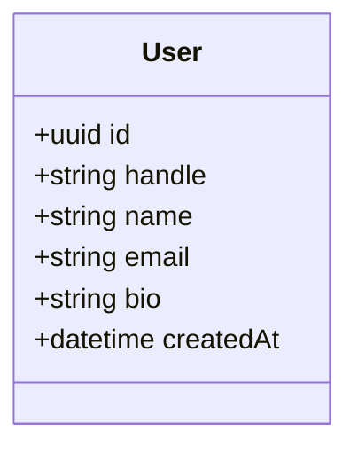
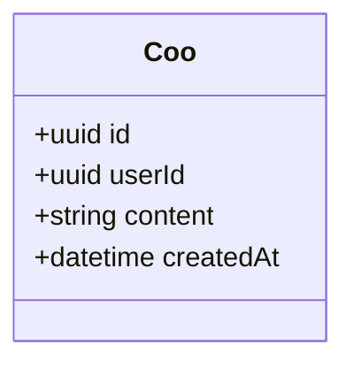
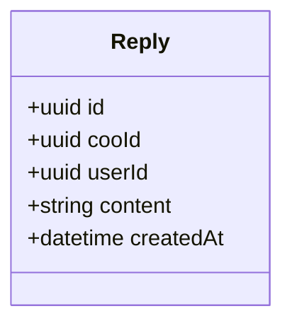
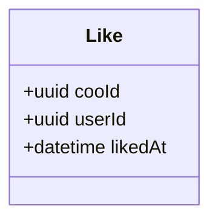
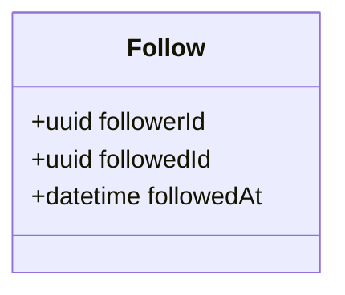
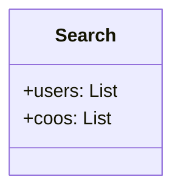

# 🕊️ Coo - Simplified Twitter Application (Single Service Layer with Microservices Proof Of Concept)

## 1. Introduction

**Coo** is a simplified social media platform inspired by Twitter. In this Proof of Concept (PoC), we use a **single service layer** with **microservices**. Each feature of the application is handled by its own microservice, such as user management, coo management, replies, likes, follows, and search functionalities. 

The system allows users to:
- Regiser a **User**
- Post a **Coo** (similar to a tweet)
- **Reply** to a **Coo**
- **Like** a **Coo**
- **Follow** other users
- Display a timeline of following **User**s' **Coo**s
- **Search** for users or coos based on specific criteria

---

## 2 Service Architecture

The PoC is structured into the following microservices:

- **User Service** – Handles user operations such as registration, updates, and deletion.
- **Coo Service** – Manages coo creation, retrieval, and updates.
- **Reply Service** – Handles replies to coos and retrieves replies for a specific coo.
- **Like Service** – Manages likes and unlikes on coos.
- **Follow Service** – Manages follow/unfollow functionality and retrieving followers/following lists.
- **Timeline Service** – Aggregates coos from followed users to generate the timeline for a user.
- **Search Service** – Allows users to search for users by handle/name or coos by title/content.

---

## 3. API Design

### 3.1 User Service

#### Endpoints:

- `POST /users/register` – Create a new user
- `PUT /users/{userId}` – Update user profile
- `DELETE /users/{userId}` – Delete a user
- `GET /users/{userId}` – Get user by ID
- `GET /users/handle/{handle}` – Get user by handle

### 3.2 Coo Service

#### Endpoints:

- `POST /coos` – Post a new Coo (similar to a tweet)
- `GET /coos/{cooId}` – Get a specific Coo
- `GET /coos/user/{userId}` – Get all coos from a specific user
- `PUT /coos/{cooId}` – Update a specific Coo

### 3.3 Reply Service

#### Endpoints:

- `POST /replies/reply/{cooId}` – Reply to a specific Coo
- `GET /replies/coo/{cooId}` – Get all replies to a specific Coo
- `GET /replies/{replyId}` – Get a specific reply

### 3.4 Like Service

#### Endpoints:

- `POST /likes/{cooId}` – Like a specific Coo
- `POST /likes/unlike/{cooId}` – Cancel like on a specific Coo
- `GET /likes/coo/{cooId}` – Get all likes for a specific Coo
- `GET /likes/count/coo/{cooId}` – Get all likes count for a specific Coo

### 3.5 Follow Service

#### Endpoints:

- `POST /follows/follow` – Follow a user
- `POST /follows/unfollow` – Unfollow a user
- `GET /follows/followers/{userId}` – Get all followers of a user
- `GET /follows/count/followers/{userId}` – Get all followers count of a user
- `GET /follows/following/{userId}` – Get all users that a user is following
- `GET /follows/count/following/{userId}` – Get all users count that a user is following

### 3.6 Search Service

#### Endpoints:

- `GET /search/users` – Search for users by handle or name
    - Query parameters: `handle`, `name`
- `GET /search/coos` – Search for coos by title or content
    - Query parameters: `text`

---

## 4. Data Model

Each service will manage its own data model. Below are the data models for each service, reflecting the **Coo** functionality.

### 4.1 User Service Model

### 4.2 Coo Model

### 4.3 Reply Model

### 4.4 Like Model

### 4.5 Follow Model

### 4.6 Search Model

