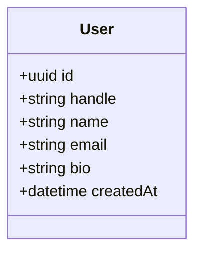
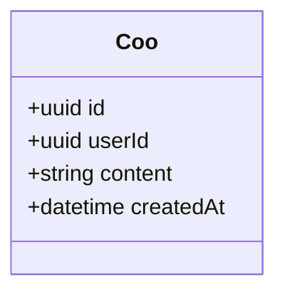
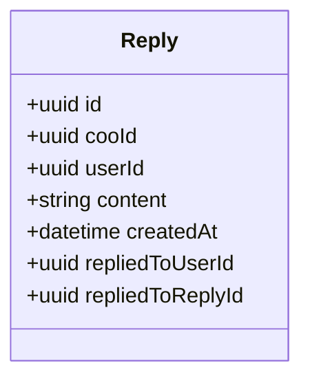
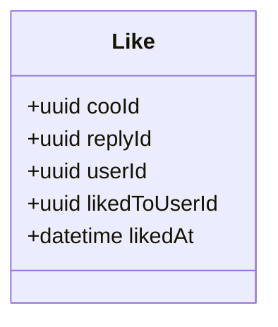
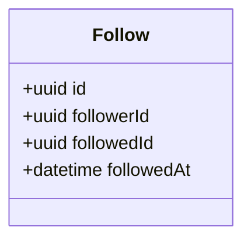
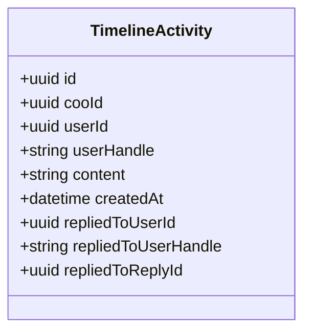
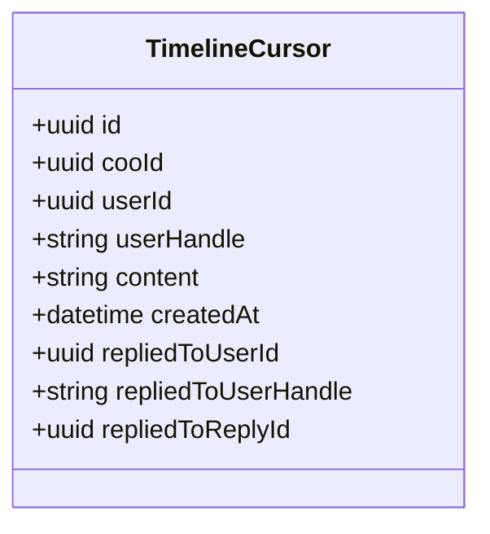
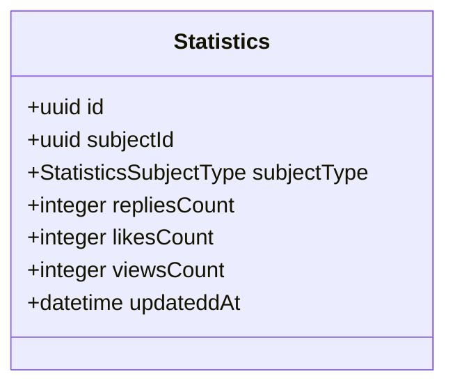
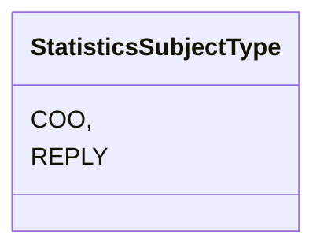

# 🕊️ Coo - Simplified Twitter Application (Single Service Layer with Microservices Proof Of Concept)

## 1. Introduction

**Coo** is a simplified social media platform inspired by Twitter. In this Proof of Concept (PoC), we use a **single service layer** with **microservices**. Each feature of the application is handled by its own microservice, such as user management, coo management, replies, likes, follows, and search functionalities. 

The system allows users to:
- Register a **User**
- Post a **Coo** (similar to a tweet)
- **Reply** to a **Coo**
- **Like** a **Coo**
- **Follow** other users
- **Search** for users or coos based on specific criteria
- Display a timeline of following **User**s' **Coo**s, replies to user's own **Coo**s, and replies to following **User**s' **Coo**s.

---

## 2 Service Architecture

The PoC is structured into the following microservices:

- **User Service** – Handles user operations such as registration, updates, and deletion.
- **Coo Service** – Manages coo creation, retrieval, and updates.
- **Reply Service** – Handles replies to coos and retrieves replies for a specific coo.
- **Like Service** – Manages likes and unlikes on coos.
- **Follow Service** – Manages follow/unfollow functionality and retrieving followers/following lists.
- **Search Service** – Allows users to search for users by handle/name or coos by content.
- **Personalize Service** – Provide personalized content based on user preferences.
- **Statistics Service** – Provides statistics about replies, likes and views counts of coo or reply

---

## 3. API Design

### 3.1 User Service

#### Endpoints:

- `POST /api/users` – Create a new user
- `PUT /api/users/{userId}` – Update user profile
- `DELETE /api/users/{userId}` – Delete a user
- `GET /api/users/{userId}` – Get user by ID
- `GET /api/users/handle/{handle}` – Get user by handle
- `GET /api/users` – Get paginated List of users
- `POST /api/users/ids` – Get a  List of users by userIds

### 3.2 Coo Service

#### Endpoints:

- `POST /api/coos` – Post a new Coo (similar to a tweet)
- `GET /api/coos/{cooId}` – Get a specific Coo
- `GET /api/coos/user/{userId}` – Get paginated List of coos from a specific user
- `PUT /api/coos/{cooId}` – Update a specific Coo
- `DELETE /api/coos/{cooId}` – Delete a specific Coo

### 3.3 Reply Service

#### Endpoints:

- `POST /api/replies/cool/{cooId}` – Reply to a specific Coo
- `POST /api/replies/reply/{replyId}` – Reply to a specific Reply
- `GET /api/replies/cool/{cooId}` – Get pagenated List of replies to a specific Coo and children replies
- `GET /api/replies/{replyId}` – Get a specific reply
- `GET /api/replies/reply/{replyId}` – Get pagenated List of replies to a specific reply
- `DELETE /api/replies/{replyId}` – Delete a specific reply

### 3.4 Like Service

#### Endpoints:
- `POST /api/likes/coo/{cooId}` – Like a specific Coo
- `POST /api/likes/reply/{replyId}` – Like a specific Reply
- `POST /api/likes/coo/{cooId}/unlike` – Cancel like on a specific Coo
- `POST /api/likes/reply/{replyId}/unlike` – Cancel like on a specific Reply
- `GET /api/likes/coo/{cooId}` – Get paginated list of likes for a specific Coo
- `GET /api/likes/reply/{replyId}` – Get paginated list of likes for a specific Reply
- `GET /api/likes/count/coo/{cooId}` – Get all likes count for a specific Coo
- `GET /api/likes/count/reply/{replyId}` – Get all likes count for a specific Reply
- `GET /api/likes/status/coo/{cooId}` – Check if a user has liked a Coo
- `GET /api/likes/status/reply/{replyId}` – Check if a user has liked a Reply

### 3.5 Follow Service

#### Endpoints:

- `POST /api/follows/{followerId}/follow/{followedId}`  - Follow a user
- `DELETE /api/follows/{followerId}/unfollow/{followedId}` - Unfollow a user
- `GET /api/follows/{userId}/followers` - Get paginated list of followers
- `GET /api/follows/{userId}/following` - Get paginated list of users the user is following
- `GET /api/follows/{userId}/followers/count` -  Get follower count
- `GET /api/follows/{userId}/following/count` - Get following count
- `GET /api/follows/{followerId}/is-following/{followedId}` - Check if a user is following another user

### 3.6 Search Service

#### Endpoints:

- `GET /api/search/users` – Search paginated list of users by handle or name
- `GET /api/search/coos` – Search paginated list of coos by content

### 3.7 Personalize Service

#### Endpoints:
- `GET /api/personalize/timeline` – Get a time cursor-based list of coos or replies tailored to user preferences

### 3.8 Statistics Service

#### Endpoints:
- `GET /api/statistics/coo/{cooId}` – Get statistics of a coo
- `POST /api/statistics/coo/{cooId}` – Create/update statistics of a coo
- `POST /api/statistics/coos` – Get statistics of multiple coos by cooIds
- `GET /api/statistics/reply` – Get statistics of a reply
- `POST /api/statistics/reply/{replyId}` – Create/update statistics of a reply
- `POST /api/statistics/replies` – Get statistics of multiple replies by replyIds
---

## 4. Data Model

Each service will manage its own data model. Below are the data models for each service, reflecting the **Coo** functionality.

### 4.1 User Service Model

### 4.2 Coo Model

### 4.3 Reply Model

### 4.4 Like Model

### 4.5 Follow Model

### 4.6 Search Model

### 4.6 Personalize Model

### 4.6 Statstics Model

